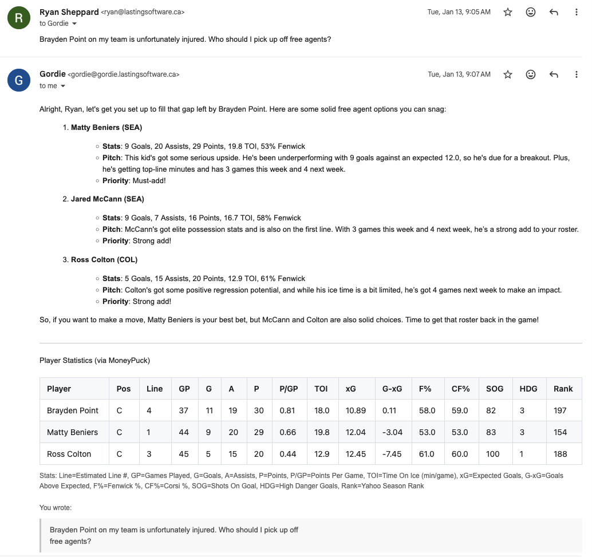
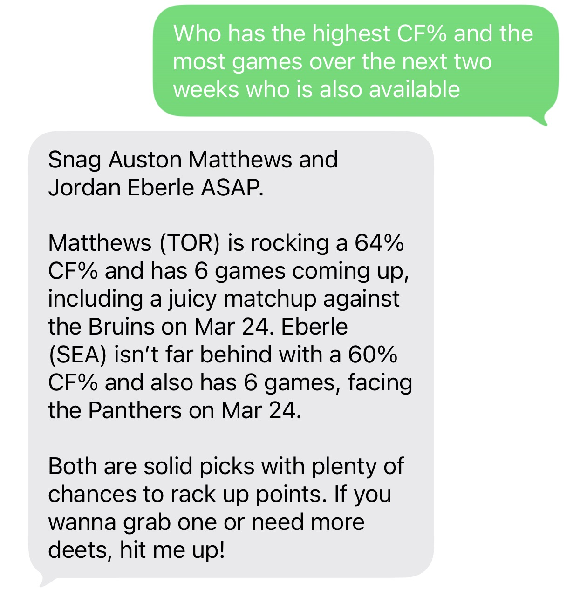
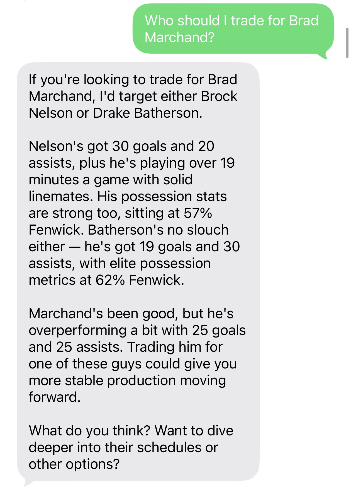
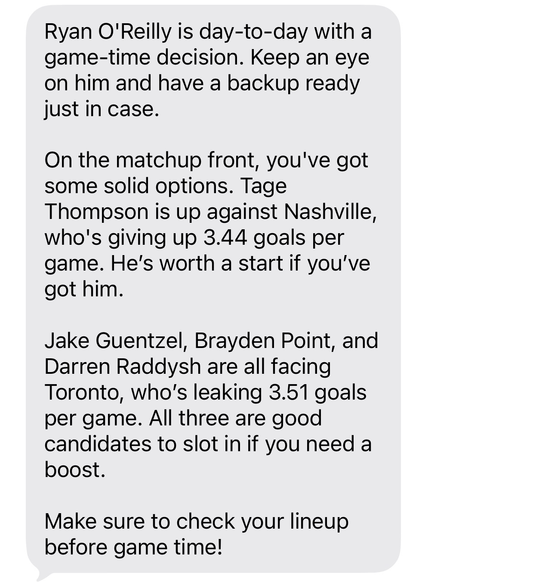

# Gordie — Fantasy Sports AI Assistant

Text or email Gordie, your fantasy sports AI manager — get roster advice, trade analysis, waiver-wire calls, and weekly digests backed by live league data, advanced stats, and your conversation history.

> ⚠️ **Hosted Gordie is temporarily offline** while the instance migrates to a more secure hosting environment.

## Showcase

Real conversations with Gordie.

<table>
  <tr>
    <td colspan="3" align="center">
      <br>
      <sub><b>Email correspondence</b> — pickup recommendations with a stats table in the reply</sub>
    </td>
  </tr>
  <tr>
    <td align="center" width="33%">
      <br>
      <sub><b>Multi-constraint stat query</b></sub>
    </td>
    <td align="center" width="33%">
      <br>
      <sub><b>Trade target analysis</b></sub>
    </td>
    <td align="center" width="33%">
      <br>
      <sub><b>Injury + matchup start/sit</b></sub>
    </td>
  </tr>
</table>

## Under the hood

- **Self-reviewing pipeline.** A separate data-quality node reviews every draft before send, checking it against statistical-rigor rules (e.g. don't compare season totals across players with wildly different games played). If a rule fails, the draft loops back to the supervisor with specific feedback — agentic LLM-as-judge baked into the response path.
- **Agent-authored SQL on an embedded analytics DB.** A scheduled job refreshes MoneyPuck (NHL) and pybaseball (MLB) data into a DuckDB file. The supervisor has a `query_hockey_stats_db(sql, situation)` tool and writes raw SQL to answer arbitrary stat questions — that's how a single message like *"highest CF% with the most games over the next two weeks, available in my league"* becomes one query rather than a flowchart of endpoints.
- **Cross-conversation semantic memory.** Gordie embeds past threads per-user; a `search_past_conversations` tool lets him recall earlier discussions ("the trade we talked about last week") instead of starting cold every message.
- **Sport-aware tool filtering middleware.** A `wrap_model_call` middleware reads the inferred sport off state and hides irrelevant tools from the model — NHL users never see MLB tools and vice versa. Sport detection is keyword-based with 5-minute stickiness so mid-conversation follow-ups don't re-classify.
- **Channel-aware voice rewrite.** A final node rewrites every sentence in Gordie's voice, with channel-specific shaping: email preserves structure, SMS enforces a 600-character hard cap via iterative condense-retry.

## Architecture

```
                ┌──────────────────────────────────────────┐
   Email ──►    │  Quart HTTP server (server/server.py)    │
   SMS   ──►    │  /email/webhook  /sms/webhook  /callback │
                └────────────────┬─────────────────────────┘
                                 │
                                 ▼
                ┌──────────────────────────────────────────┐
                │  LangGraph supervisor agent              │
                │  (agent/SupervisorAgent.py)              │
                │  + sub-agents: trade, available, stats   │
                └────────────────┬─────────────────────────┘
                                 │
            ┌────────────────────┼────────────────────────┐
            ▼                    ▼                        ▼
    Yahoo Fantasy API     Postgres (state +       Sport stats DuckDB
                          checkpoints + memory)   (NHL: MoneyPuck,
                                                   MLB: pybaseball)
```

Scheduled digests (`scheduled/weekly_digest.py`, `agent/news/`) run via APScheduler inside the server process.

## Repo layout

```
agent/         LangGraph nodes, prompts, sub-agents
client/        External API clients (Yahoo, ESPN news, MoneyPuck)
data/          SQLAlchemy models + Alembic migrations
frontend/      SvelteKit marketing site
middleware/    Tool-call filters and state-logging middleware
module/        Config, logging, LLM factory
scheduled/     APScheduler jobs (stats refresh, weekly digest, news digest)
server/        Quart app, route registrations, vendor services
tests/         pytest unit + integration + eval suites
tools/         Agent-callable tools (per-sport stats, billing, memory, etc.)
```

## License

AGPL-3.0 — see `LICENSE`. If you run a modified version as a network service, you must publish your changes under the same license. For commercial licensing (no copyleft), contact support@lastingsoftware.ca.
